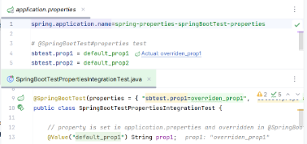

# Spring Boot configuration properties set via @SpringBootTest#properties

spring debugger:
evaluation works for these properties, and the actual value is shown in the `application.properties`
for the overridden properties, but:
 Source|Override action in debugger doesn't work for the properties set via `@SpringBootTest#properties`

https://youtrack.jetbrains.com/issue/IDEA-365978/Spring-Debugger-properties-evaluation-navigation-to-source-fails-for-properties-set-in-test-annotations

Navigation via 'actual value' inlay to the overridden property in `@SpringBootTest` annotation
works, but throws the exception
https://youtrack.jetbrains.com/issue/IDEA-366126/Throwable-Assertion-failed-Should-be-invoked-in-manager-thread-use-DebuggerManagerThreadImpl.schedule-at

