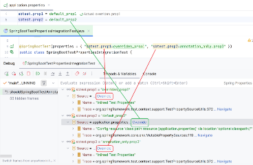

# Spring Boot configuration properties set via @SpringBootTest#properties

spring debugger:
evaluation works for these properties, and the actual value is shown in the `application.properties`
for the overridden properties, but:
 Source|Override action in debugger doesn't work for the properties set via `@SpringBootTest#properties`

